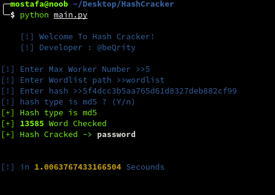

# hash-cracker
### A simple hash cracker written in Python programming language!

# Getting started
#### Clone Script and run it
 ```
 git clone https://github.com/mostafa-arshadi/hash-cracker.git
 cd hash-cracker
 python3 main.py
```
Image
-----


